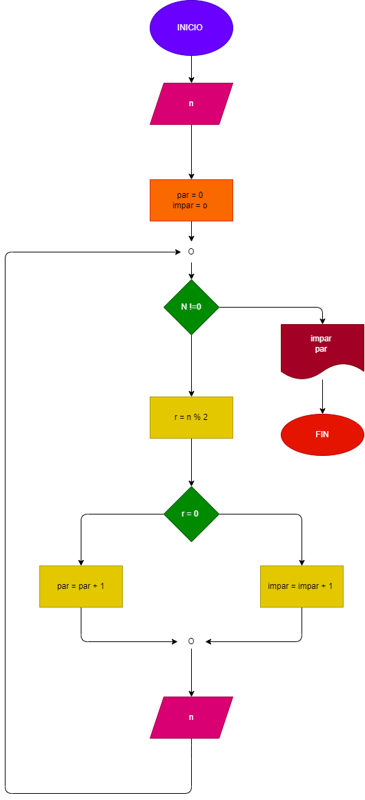

# EJERCICION No. 29

# Crear un programa que lea numeros enteros y positivos (Uno en cada lectura, y que averigue e imprina cuantos son pares y cuantos son impares.) para terminar utilizaremos el registro sentinela cuando el valor o numero leido sea 0 

## Diagrama de flujo 
